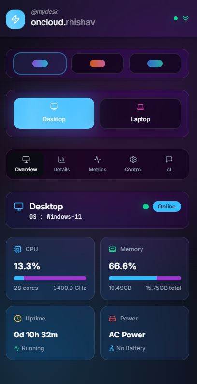
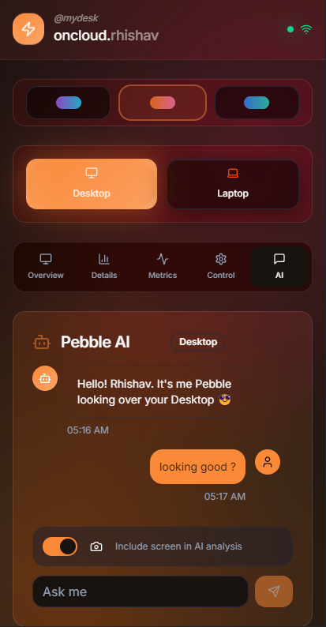
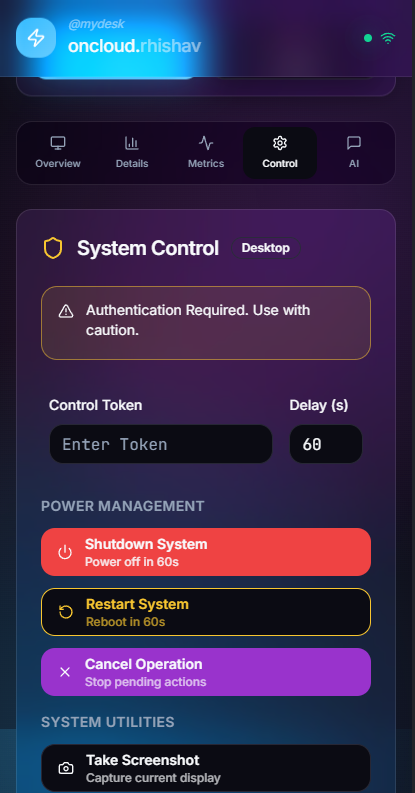
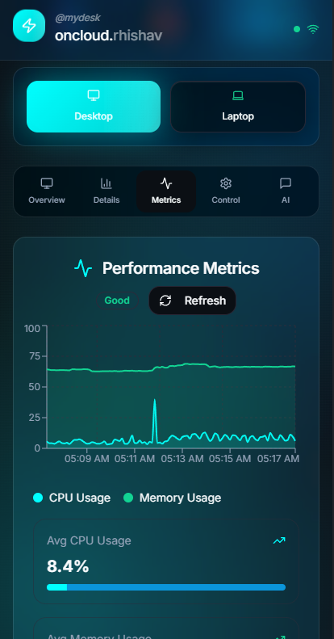

# 🔮 myDesk - Cloud Management App

Built with a modern, cross-platform stack.

   


A sleek, modern dashboard to monitor and interact with all your connected devices. Ever wanted to ask your computer if it's running a game from your phone? Now you can. It's your entire workspace, in your pocket.

| Overview | AI Agents | Control | Metrics |
|:---:|:---:|:---:|:---:|
|  |  |  |  |
---
*AND MUCH MORE!*

## ✨ Features

* **Live Device Monitoring**: Real-time stats for CPU, RAM, Uptime, and Online Status for all your connected devices.
* **Multi-Device Support**: Seamlessly switch between your desktop, laptop, and more.
* **Remote Control**: Shutdown, reboot, and capture screenshots on the fly, directly from the app.
* **AI-Powered Chat**: Talk to your systems using natural language. Powered by Google's Gemini with function-calling capabilities.
* **Sleek, Glassmorphism UI**: A modern, beautiful interface inspired by the best in mobile design.
* **Built for Mobile**: A fully responsive cross-platform experience.

---

## ⚙️ Configuration

Before running, you need to tell the app where to find your backend APIs.

1.  Open the `src/constants/devices.js` file.
2.  Update the `baseUrl` for each device to point to your public domain or local IP addresses.

```javascript
// src/constants/devices.js

export const DEVICES = [
    {
        name: 'My Desktop',
        endpoint: '/desktop',
        baseUrl: 'https://example.com' // Your public domain or local IP
    },
    {
        name: 'My Laptop',
        endpoint: '/laptop',
        baseUrl: 'https://example.com' // Your public domain or local IP
    },
];
```


## 🔗 Backend Requirement

This frontend is just one half of the magic. It requires the corresponding **[myDesk Backend (oneCloud)](https://github.com/Rhishavhere/onecloud)** to be running on your target devices. Make sure they are active and accessible at the URLs you specified in the configuration.

